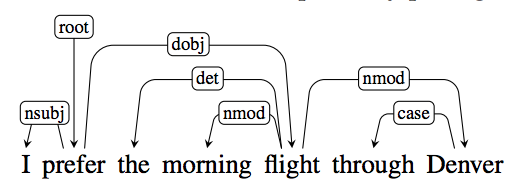

# Neural graph-based Dependency parser

In this project you will build a dependency parser from scratch!

## Introduction

In this project you will build a **graph-based dependency parser** that is trained using **neurals networks** with the help of **PyTorch**.

Concretely, you will:

* Read the relevant literature on dependency grammars, graph algorithms, and neural networks
* Use this to re-implement the model described in [Dozat & Manning (2017)](https://arxiv.org/abs/1611.01734), which is an extension of [Kiperwasser & Goldberg (2016)](https://aclweb.org/anthology/Q16-1023)
* Train this model on annotated data from the [Universal Dependencies project](http://universaldependencies.org/). Next to English, you will choose one other language to investigate. Ideally you choose a language that you are familiar with, so that you can interpret the performance of you model!
* Use the trained model to parse sentences in a test-set, and evaluate how well it performs
* Run a baseline dependency parser (that we provide) to get some scores. See if you can beat them with your own parser!

At the end of the project you will have a fully working parser! If time permits, you can do a number of interesting things with it: investigate its performance on very hard sentences (look [here](https://en.wikipedia.org/wiki/List_of_linguistic_example_sentences#cite_note-1) for inspiration!); inspect the trained neural network to see what it has learned; investigate the type of grammatical errors your parser makes; or you could even come up with an improvement to the model!

Read on for more details.

## Dependency grammar

**Dependency grammar** is a grammatical formalism that is based on word-word relations. This means that the grammatical structure of a sentence is described solely in terms of the **words** in a sentence and the **syntactic relations** between the words.

Here is an example of a sentence annotated with dependency relations:

(We will refer to the above interchangebly as: a **dependency parse**; a **dependency graph**; and **dependency tree**.)

**Dependency parsing** is the task of taking a bare (unannotated) sentence like *I prefer the morning flight through Denver* and then assigning a syntactic structure to it. If our parser is good, it will assign (roughly) the parse in the image above.

<!-- A dependency tree can help to disambiguate the meaning of a sentence. -->

<!-- Take the following example from Jurafsky and Manning chapter 12: "To answer the question

> What books were written by British women authors before 1800?

we’ll need to know that the subject of the sentence was *what books* and that the by-adjunct
was *British women authors* to help us figure out that the user wants a list of
books (and not a list of authors)." --> -->

<!-- A dependency grammar provides us which this information! --> -->

<!--
- I saw [the girl] [with the telescope].
- I saw [the girl with the telecope].
Our dependency trees will also have labels, e.g. “I” is in a subject relation with “saw”.

 -->

## Graph algorithms

This project is about *graph-based* dependency parsing.

This means we you will use a graph algorithm like [Chu-Liu-Edmonds' algorithm](https://en.wikipedia.org/wiki/Edmonds%27_algorithm) or [Eisner's algorithm](http://curtis.ml.cmu.edu/w/courses/index.php/Eisner_algorithm). These algorithms are used to find the so called **minimum-spanning-tree** [(MST)](https://en.wikipedia.org/wiki/Minimum_spanning_tree) in a graph. They are general graph algorithms used for all kinds of discrete optimisation tasks.

The way **we** will use these algorithms is as follows. Let's say we have a sentence. Our model assigns **weights** to **all possible arcs** between the words in the sentence (more below about how we get these weights). This gives us a **complete graph** on all the words in the sentence, with **weighted arcs**. Then, we use one of the above algorithms to obtain the minimum-spanning tree in this complete graph. What we obtain is the predicted **dependency tree** for the sentence under consideration.

The following image gives a good visual summary of the process.

The dotted lines show the complete graph. (Each of these is assigned a weight) The solid lines the obtained minimum-spanning-tree. This gives use then the dependency parse

Note: the **labels** on the arcs are **not** obtained using this algorithm. They are predicted afterwards. (We will discuss this later)

<!--
(for projective trees, suitable for languages such as English) and/or [Chu-Liu-Edmonds](https://en.wikipedia.org/wiki/Edmonds%27_algorithm) (for non-projective trees, languages such as German) to find the minimum-spanning tree (MST) given the weights your model assigns between each pair of words.
 More about this below!

The advantage of graph-based dependency parsers is that they can work well on languages with discontinuities,
such as Dutch and German, because we can extract non-projective dependency trees from them. -->

## Neural networks

For the method above to work well, we need to assign **weights** to all the possible edges. These weights are crucial for obtaining good parses; they essentially control which tree we obtain! But how do get them? For this we will use a **neural network**.

`[Under development]`

## Required readings

1. J&M 3rd edition, chapter [Dependency parsing](Jurafsky&ManningCh14.pdf). Skip section 14.4 for now. In this section a so called *transition*-based parsing method is discussed; we will focus on the *graph*-based parsing method introduced in section 14.5.
2. [Kiperwasser & Goldberg (2016)](Kiperwasser&Goldberg2016.pdf)
3. [Dozat & Manning (2017)](Dozat&Manning2017.pdf) (also see their [poster](TDozat-ICLR2017-Poster.pdf) and [slides](TDozat-CoNLL2017-Presentation.pdf)!)
